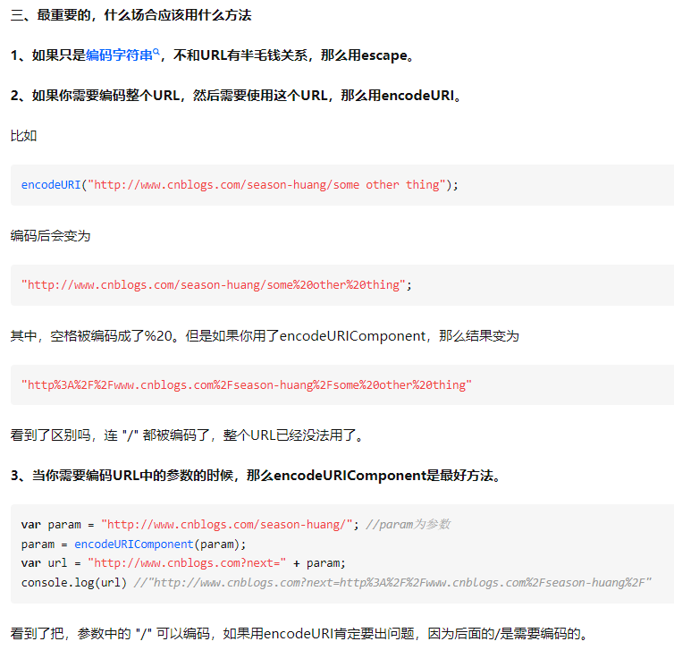

escape() 函数可对字符串进行编码，这样就可以在所有的计算机上读取该字符串。

注意：
- 该方法不会对 ASCII 字母和数字进行编码，也不会对下面这些 ASCII 标点符号进行编码： - _ . ! ~ * ' ( ) 。其他所有的字符都会被转义序列替换。
- 当你需要对URL编码时，请忘记这个方法，这个方法是针对字符串使用的，不适用于URL。

encodeURI和encodeURIComponent 都是针对URL的。唯一区别就是编码的字符范围。

encodeURI方法不会对下列字符编码 ASCII字母 数字 ~!@#$&*()=:/,;?+'
encodeURIComponent方法不会对下列字符编码 ASCII字母 数字 ~!*()'
所以encodeURIComponent比encodeURI编码的范围更大。

实际例子来说，encodeURIComponent会把 http:// 编码成 http%3A%2F%2F 而encodeURI却不会。

所以，使用场合：

1、如果只是编码字符串，不和URL有半毛钱关系，那么用escape。
2、如果你需要编码整个URL，然后需要使用这个URL，那么用encodeURI。
3、如果要把这个URL当做参数，那么用encodeURIComponent。

参考链接：
- https://www.zhihu.com/question/21861899/answer/20300871