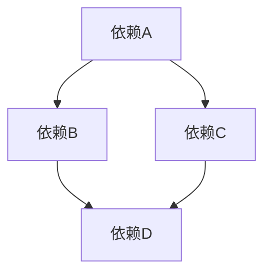

## 背景

目前主流的包管理工具主要是：npm，yarn，和 pnpm。

比如我们项目以下面依赖为例（项目中只 install 了依赖 A）：

## npm

最开始的 npm（`npm2 版本`）采用的是树形结构，也就是在 node_modules 中，只有依赖 A 的文件夹，A 文件夹下有 B，C 文件夹，B，C 文件夹下分别有 D 文件夹。

很明显，可以看出一个问题，就是 B，C 文件夹下都有依赖 D，也就是依赖重复，会占据比较大的磁盘空间。

另一个问题是，这种嵌套的方式，会导致有一些操作系统（比如 windows 的文件路径最长是 260 多个字符），如果嵌套过多就会出问题。

于是，社区就出来新的解决方案了，就是 `yarn`。

## yarn

yarn 的解决方案很简单，就是 npm 不是嵌套过深嘛，那我就平铺开来，node_modules 下面直接就是依赖 A，B，C，D 四个文件夹，不存在嵌套关系。

> npm 后来升级到 3 之后，也是采用这种铺平的方案了，和 yarn 很类似。

这样，貌似重复依赖和嵌套过深的问题就解决了，但是却引入了新的问题，那就是“**幽灵依赖**”。

什么是“幽灵依赖”？

还是以上面的例子为例，本来我只 install 了依赖 A，但是因为平铺开来，导致 node_modules 就有 A，B，C，D 了，那么我就直接可以在代码中 import B，C，D 了。

也就是说，我没有 install 却可以直接用。

直接用有什么问题呢？

第一，如果你在代码直接导入 B，将来 A 版本升级了，A 的依赖 B 页升级了，导致代码报错，这样的问题很难发现，为什么我升级 A，别的地方却出错了呢？问题很难定位。

第二，假如 A 是开发依赖，也就是不会打包到最终的 dist 里面，那么最终的包里面是没有依赖 B 的，那引用 B 的地方在生产环境就会报错了。

所以，“幽灵依赖”要咋解决？ 这不是 pnpm 就出来了嘛。

## pnpm

pnpm 也是一个包管理工具，它通过硬连接和软链接的方式来减少重复依赖的复制，节省了磁盘空间。

它解决了 npm2 的依赖复制和路径过长的问题，也避免了 yarn 和 npm3+ 的幽灵依赖和多次复制依赖的问题。

具体是 pnpm 怎么做的呢？

首先，当我们使用`pnpm install`的时候，并没有把依赖安装到 node_modules 中，而是存在本地的一个 pnpm store 全局仓库中，然后在 node_modules 中通过 link 的方式链接到 store 仓库的，在 node_modules 中的依赖可以理解成一个快捷方式，基本不占用空间的。

在 node_modules 中，依赖采用的是树形结构，这样就避免了“幽灵依赖”，然后在 store 中采用扁平的结构，就避免了“重复依赖”和“嵌套过深”的问题，这两者一结合，就完美解决了 npm 和 yarn 的问题。

而且，这种方式还能带来一个好处就是“节省磁盘空间”。

想象一下，如果我们本地有 10 个前端项目，那么安装后就会产生 10 份依赖存到本地，但是如果采用 pnpm store 的方式，如果有的项目采用相同的依赖，那么就不需要下载了，直接 link 到 store 即可。

另外，真多多个项目依赖一个库的不同版本，pnpm 会下载该库的不同版本放在 store 的，各个项目会引用不同版本的库，互不影响。

总结一下 pnpm 的优势：

1. 主要解决了 npm 和 yarm 的“重复依赖”，“嵌套过深”和“幽灵依赖”问题
2. 速度快：pnpm 在安装、更新和删除包时速度极快，这得益于它独特的文件系统和缓存机制。
3. 节省空间：pnpm 使用硬链接和符号链接来存储包，从而减少了磁盘空间的占用。

## 参考

[pnpm 是凭什么对 npm 和 yarn 降维打击的](https://mp.weixin.qq.com/s/bLthdXlmu8wtC3ScAaZ3Kg)
